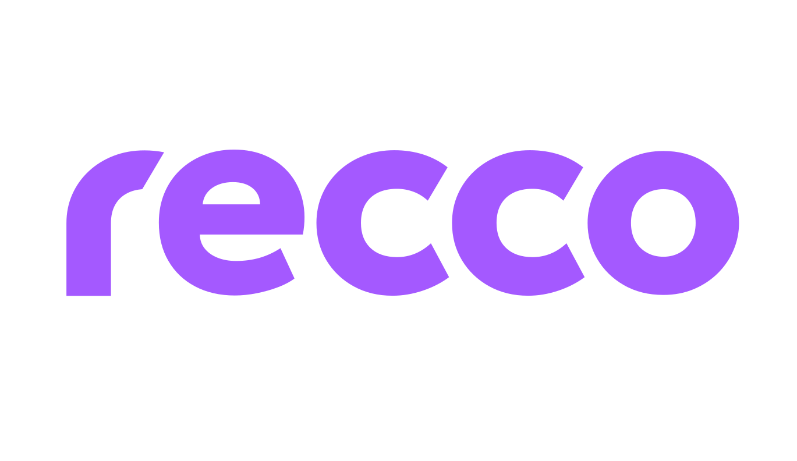
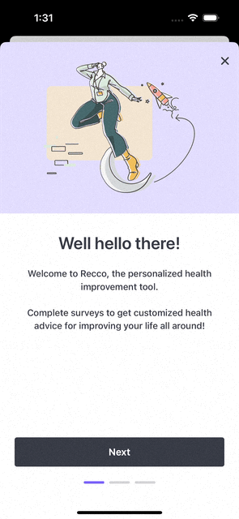
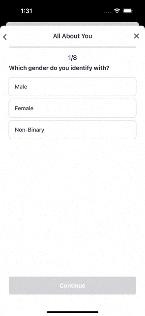

# Recco iOS SDK

This repository holds the codebase for the Recco iOS SDK. Instructions on how to add and use this iOS library can be found in the [Usage](#usage) section.

You are more than welcome to clone the repository and compile it yourself to run the Showcase app. You can also [write to us](mailto:recco@significo.com) requesting direct access to a Testflight build of our showcase application, for those members of your team who may be less tech savvy.

However, please be aware that in order to actually integrate it into your own application, you will first need to contact our sales team to initiate the license acquisition process. For that purpose, please send an email to recco@significo.com.

## Overview

Personalized and user-friendly approach to health and wellness recommendations based on users' unique interests, motivations, and health behaviors. Whether they are looking to improve their fitness, manage their stress, or simply lead a more fulfilling life, __`Recco` is designed to help them reach their full potential.__

_We believe that everyone deserves to live their best life, and we are committed to making that vision a reality, through our cutting-edge technology and unwavering dedication to scientific accuracy._

## Mission

We want you to experience firsthand the effectiveness of our `recommendation engine`. Empower users to achieve their best selves through personalized recommendations that are grounded in the latest scientific research. 

Enabling products to provide their users with a wealth of knowledge, tips, and exercises to help them improve their behavior and achieve their goals.

|                                      |                                      |                                       |
|--------------------------------------|--------------------------------------|---------------------------------------|
| <picture><source media="(prefers-color-scheme: dark)" srcset=".art/recco-onboarding-dark.gif"><source media="(prefers-color-scheme: light)" srcset=".art/recco-onboarding-light.gif"></picture> | <picture><source media="(prefers-color-scheme: dark)" srcset=".art/recco-questionnaire-dark.gif"><source media="(prefers-color-scheme: light)" srcset=".art/recco-questionnaire-light.gif"></picture> | <picture><source media="(prefers-color-scheme: dark)" srcset=".art/recco-dashboard-dark.gif"><source media="(prefers-color-scheme: light)" srcset=".art/recco-dashboard-light.gif"></picture> |


## Key features

__Keeping it simple__ 

We believe in open communication and encourage individuals to take ownership and responsibility for their actions. We reject the notion of blame culture and instead embrace collaboration, recognizing that we are stronger together. Let us extend a helping hand to one another as we work towards achieving our common goals.

__Seamless integration__

This product has a special focus on working smoothly with existing products. Recco can be configured and fully operational in just a few steps.

__Technological trend__

Recco aims to be in line with modern solutions and development trends. We followed the best practices and official guidelines to keep quality at is highest level.

__Analytics & Reporting__ 

Monitor the utilization and impact of the recommendation engine. You can track key metrics, such as user engagement, satisfaction levels, and health outcomes to evaluate the effectiveness of our solution.

__Personalized content__ 

Our engine learns to recommend content for each topic that motivates the user to improve their health behavior. The recommendations will change based on the path the user chooses, and will always recommend content, which will help the user to move forward.

Once integrated, __Recco__ will be part of your product, and can be experienced as a __full interactive journey__ for your users. 

## Setup

You can install the Recco SDK using several methods:

### Swift Package Manager

Using Xcode: 

+ File > Swift Packages > Add Package Dependency
+ Add `https://github.com/sf-recco/ios-sdk.git`
+ Select "Up to Next Major" with "1.0.0"

To integrate using Apple's Swift package manager, without Xcode integration, add the following dependency to your `Package.swift`:

```swift
dependencies: [
    .package(url: "https://github.com/sf-recco/ios-sdk.git", .upToNextMajor(from: "1.0.0"))
]
```

### Cocoapods

To integrate Alamofire into your Xcode project using CocoaPods, specify it in your Podfile:

```ruby
pod 'ReccoUI'
```

## Usage

This section aims to explain how Recco integration in iOS projects is accomplished. Make sure you also check out [Flutter][Recco-Flutter] and [Android][Recco-Android] counterparts!

To integrate the SDK into your application, you will need to follow the following steps:

### Initialization

Initialization serves the purpose of establishing your `clientSecret`, and loading the appropiate resources for the SDK to function. It also allows you to set up any styling that suits your application. To do this, add the following code to your `AppDelegate.willFinishLaunchingWithOptions` or `App.init` instance:

```swift
import ReccoUI

ReccoUI.initialize(
    clientSecret: "<myClientSecret>",
    style: .summer // or your previously created ReccoStyle
)
```

#### Internal errors

If your application ever has the need to react to any of Recco's internal errors, than you can supply a closure through the `initialize` method like so: 

```swift
import ReccoUI

ReccoUI.initialize(
    clientSecret: "<myClientSecret>",
    style: .summer // or your previously created ReccoStyle,
    logger: { (error: Error) in print(error) }
)
```

__Be mindful that if you don't initialize the SDK before using it, everything will just error out.__

### Logging in and out

The SDK focuses on providing tailored content to each of your users. For this reason, everytime your app logs a user in or out, you will need to tell Recco that it has happened. 

Logging your user in on Recco will just require you to pass along a __unique identifier__ for that user. We recommend you don't use any critical piece of information to do this, but in any case, our backend hashes and stores that unique ID for good measure. Calling login in the SDK then, will work like this: 

```swift
import ReccoUI

// ideally you would call this method after a successful login into your own system
// ReccoUI.login(userId:) is an async function, be sure to run it in an async context.

do {
    try await ReccoUI.login(userId: "user@mail.com") // you don't need to use an email here, just any unique id related to that user
} catch {
    // handle network error
}
```

And when your user logs out of your app successfully, just call: 

```swift
import ReccoUI

// ReccoUI.logout is an async function, be sure to run it in an async context.

do {
    try await ReccoUI.logout()
} catch {
    // handle network error
}
```

### Entry point to Recco

After initialization and loging in, you just need to provide an entry point in your app to show Recco. You can use any kind of button or view to achieve this, but once you want to open Recco, you will need to present our `UIViewController`, or our `SwiftUI` view. You can do this like so:

```swift
// using UIKit
// i.e. after the user taps a button:

let reccoViewController = ReccoUI.reccoRootViewController()
yourAppCurrentViewController.present(reccoViewController, animated: true)

// using SwiftUI
// inside your View, a button will toggle the displayRecco variable

YourAwesomeView()
  .sheet(isPresented: $displayRecco) {
    ReccoUI.ReccoRootView()
  }
``` 

## Releases

Our [CHANGELOG.md](./CHANGELOG.md) contains information on all releases.

[Recco-Flutter]:https://github.com/viluahealthcare/recco-flutter-showcase
[Recco-Android]:https://github.com/sf-recco/flutter-plugin
