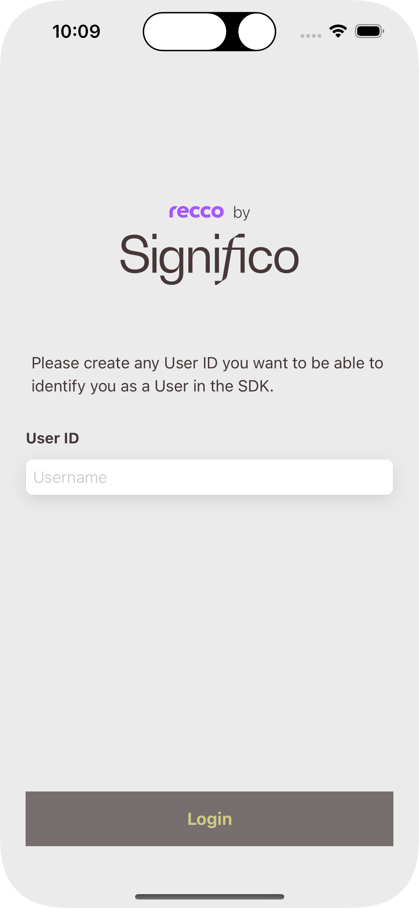
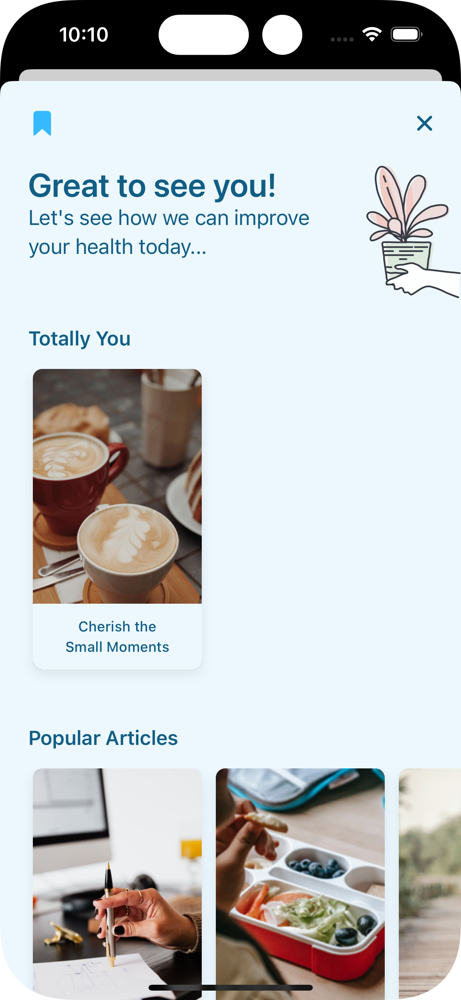
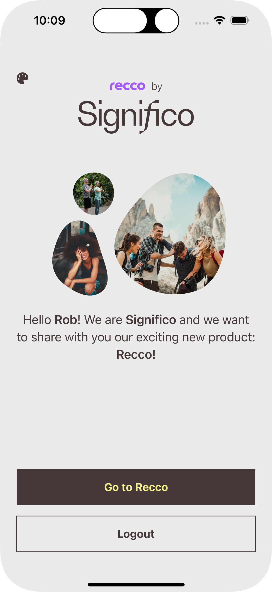

# Recco

## Overview

Personalized, and user-friendly approach to health and wellness recommendations based on users' unique interests, motivations, and health behaviors. Whether they are looking to improve their fitness, manage their stress, or simply lead a more fulfilling life. __`Recco` is designed to help them reach their full potential.__

_We believe that everyone deserves to live their best life, and we are committed to making that vision a reality through our cutting-edge technology and unwavering dedication to scientific accuracy._

## Mission

Allow experiencing firsthand the effectiveness of our `recommendation engine`. Empower users to achieve their best selves through personalized recommendations that are grounded in the latest scientific research. 

Enabling products to provide their users with a wealth of knowledge, tips, and exercises to help them improve their behavior and achieve their goals.

|                                      |                                      |                                       |
|--------------------------------------|--------------------------------------|---------------------------------------|
|  |  |  |


## Key features

__Keeping it simple__ 

We believe in open communication and encourage individuals to take ownership and responsibility for their actions. We reject the notion of blame culture and instead embrace collaboration, recognizing that we are stronger together. Let us extend a helping hand to one another as we work towards achieving our common goals.

__Seamless integration__

This product has a special focus on working smoothly with existing products. With very few steps Recco can be configured and fully operational.

__Technological trend__

Recco aims to be in line with modern solutions and development trends, best practices and official guidelines are followed to keep quality at is highest level.

__Analytics & Reporting__ 

Monitor the utilization and impact of the recommendation engine. You can track key metrics like user engagement, satisfaction levels, and health outcomes to evaluate the effectiveness of our solution.

__Personalized content__ 

Our engine learns to recommend the user content for each topic that the user motivate to improve their health behavior. The recommendations will change on the path of the user and will recommend always the content which the user helps to go forward in the specific time.

## Setup

__Recco__ can be integrated and be part of your product the whole product experience, is brought in the shape of a a __full user interactive journey__ having all features included.

Following this approach, integration brings access to services in which the UI solution leans, so consumers can develop __their own experiences__.

To integrate using Apple's Swift package manager, without Xcode integration, add the following as a dependency to your `Package.swift`:

```swift
.package(url: "https://github.com/recco/recco-ios-sdk.git")
```

and then specify `"Recco"` as a dependency of the Target in which you wish to use Recco.
Here's an example `PackageDescription`:

```swift
// swift-tools-version:5.3
import PackageDescription

let package = Package(
    name: "MyPackage",
    products: [
        .library(
            name: "MyPackage",
            targets: ["MyPackage"]
        ),
    ],
    dependencies: [
        .package(
            url: "https://github.com/recco/recco-ios-sdk.git", .upToNextMajor(from: "0.0.8"))
    ],
    targets: [
        .target(
            name: "MyPackage"
        )
    ]
)
```
## Releases

Our [CHANGELOG.md](./CHANGELOG.md) contains all releases information.

All artifacts are available in [Github][Github-Recco].

## Usage

This section aims to explain how Recco integration in iOS projects is accomplished. Make sure, you also check out [Flutter][Recco-Flutter] and [Android][Recco-Android] counterparts !

You will find a more detailed implementation example and a full UI journey explanation in the [Showcase][Recco-Showcase] document.

[Github-Packages]:https://github.com/features/packages
[PAT]:https://docs.github.com/en/authentication/keeping-your-account-and-data-secure/managing-your-personal-access-tokens
[Github-Recco]:https://github.com/orgs/viluahealthcare/packages?repo_name=recco-ios-sdk
[Recco-Flutter]:https://github.com/viluahealthcare/recco-flutter-showcase
[Recco-Android]:https://github.com/viluahealthcare/recco-android-sdk
[Recco-Showcase]:./docs/SHOWCASE.md
[Recco-Download]:https://app.bitrise.io/app/2e7050f9-468b-45b6-8ab9-73124007335f/build/56d78bb3-52d2-[…]/artifact/aea7957d222cc658/p/6f1f326e75afe5da5aa3a1bd56bbba71
[Recco-QR]:./art/recco_qr.png
